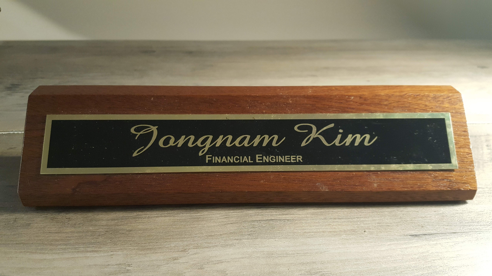

## Jongnam Kim

 

## Project

1. Python for Finance

1. Financial Engineering

1. Algorithmic Trading

## Book

1. [Challenge to Financial Engineering at the age of 44](https://www.amazon.com/My-Challenge-Financial-Engineering-age/dp/1097371832/ref=sr_1_2?keywords=financial+engineering+at+the+age+of+44&qid=1570423682&sr=8-2) (June 2019 published)

1. [Coursework for Financial Engineering at the age of 44](https://wikidocs.net/31740) (preparing, Nov. 2019 expected)
1. Algorithmic Trading at the age of 44 (preparing, Dec. 2019 expected)
